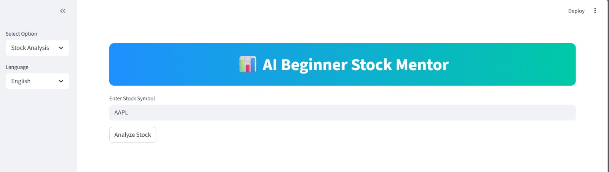
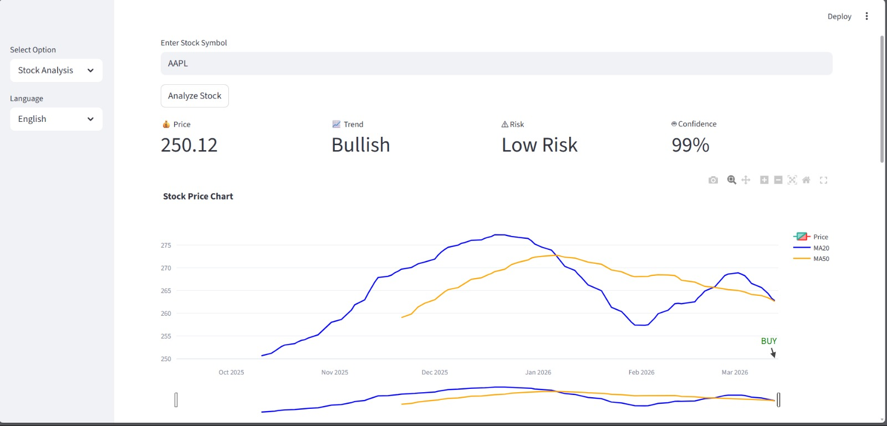
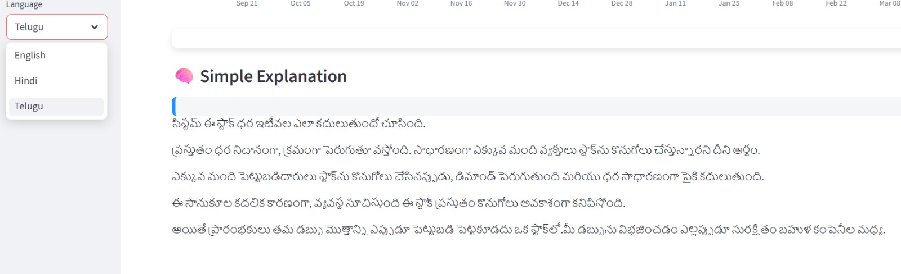
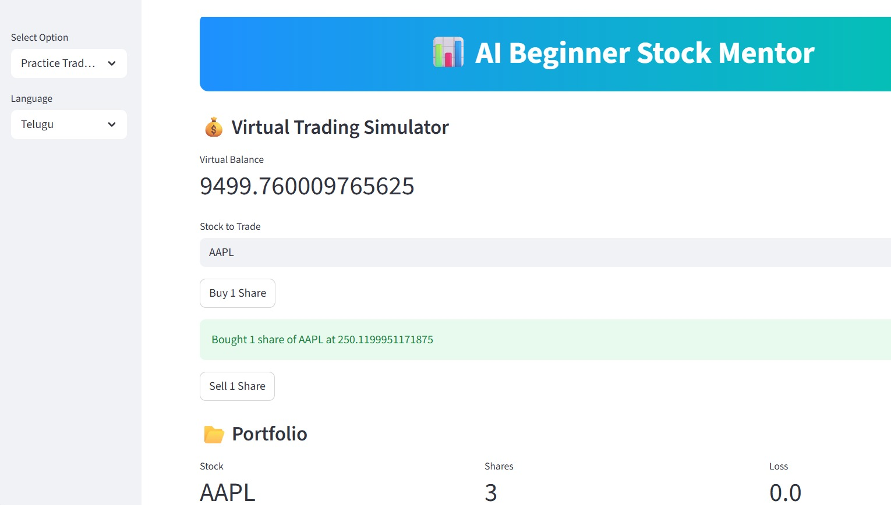

# 📊 AI Beginner Stock Mentor

AI Beginner Stock Mentor is a beginner-friendly stock analysis platform that helps users understand stock market behavior through real-time data visualization, simple explanations, and a virtual trading simulator.

This project was developed during a *FinTech Workshop* to demonstrate how financial data and AI-based insights can help beginners learn stock market concepts in an interactive way.

---

## 🚀 Features

- 📈 Real-time stock data analysis
- 📊 Candlestick chart visualization
- 📉 Technical indicators (Moving Averages, RSI)
- 📊 Volume analysis
- 🔍 Buy/Sell trend signals
- 🧠 Beginner-friendly stock explanation
- 💰 Virtual trading simulator with portfolio tracking
- 🌍 Multi-language explanation support

---

## 🛠 Technologies Used

- Python
- Streamlit
- Pandas
- Plotly
- yfinance API

---

## 💻 Installation
-->Clone the repository:
//bash
git clone https://github.com/shivanijajjela/AI-Beginner-Stock-Mentor.git

## Go into the project folder:
//Bash
cd AI-Beginner-Stock-Mentor

## Install dependencies:
//Bash
pip install -r requirements.txt

## Run the application:
//Bash
streamlit run app.py
## 📷 Project Screenshots

## 🎯 Purpose of the Project
  The main goal of this project is to make stock market learning easier for beginners by providing simple explanations along with visual financial analysis.
  Users can also practice trading using virtual money without risking real investments.
## ⭐ Future Improvements
  AI-based stock prediction models
  News sentiment analysis
  Advanced technical indicators
  Portfolio risk analysis
## 👩‍💻 Author
  Shivani Jajjela
  AIML Student passionate about AI, Data Science, and FinTech applications.
## ⭐ If you found this project useful, feel free to star the repository!
